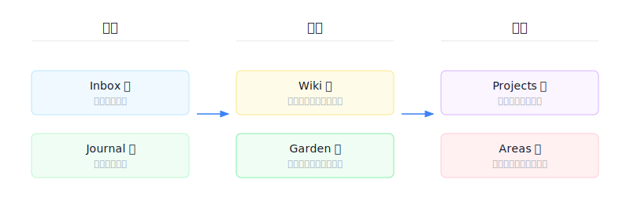
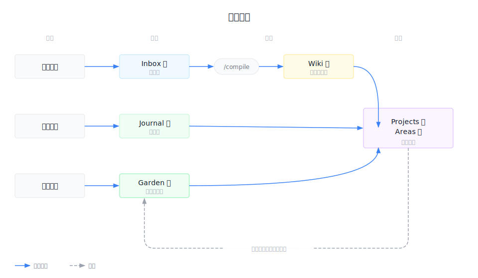

# {{VAULT_NAME}}

> 👋 **刚拿到 hum？** 先跳到下面的「第一次使用 hum」走一遍。

我的个人知识库。让思考随时间积累。

## 第一次使用 hum

1. 往 `10 Inbox 📥/` 扔 2-3 篇你关注的文章（整篇文字复制粘贴成 `.md`，或直接贴 URL 让 Claude 抓）
2. 在 vault 目录打开 Claude Code，跑 `/compile`——它会把 Inbox 的原料编译成 `20 Wiki 📖/` 下的条目
3. 问 Claude："最近有什么新信息？"——它会从刚编译的 Wiki 里拉给你看

这条流程跑通之后，你就理解了 hum 的核心循环：**扔进来 → 编译 → 对话**。

## 设计理念

知识的流动分三层：**捕获 → 积累 → 创作**。

每一层解决不同的问题：

- **捕获**：降低记录门槛，什么都能扔进来
- **积累**：让知识可查、可连接、可生长
- **创作**：把积累的知识变成实际产出

## 目录说明

### 捕获层（输入）

| 文件夹 | 用途 | 内容举例 |
|--------|------|---------|
| `10 Inbox 📥` | 外部素材的原料池 | 网页摘录、文章链接、读书划线、摘抄 |
| `11 Journal 📓` | 个人碎片的时间线 | 灵感、感悟、日常反思、随手记 |

### 积累层（知识）

| 文件夹 | 用途 | 内容举例 |
|--------|------|---------|
| `20 Wiki 📖` | 别人的知识，LLM 编译 | 百科式条目、框架整理、概念索引 |
| `21 Garden 🌱` | 自己的洞察，持续生长 | 读书理解（Canvas）、个人经验、自己的框架 |

**Wiki 和 Garden 的区别**：Wiki 是客观参考（别人说了什么），Garden 是主观理解（我怎么看）。Wiki 由 LLM 编译维护，Garden 由我亲手打磨。

### 创作层（输出）

| 文件夹 | 用途 | 内容举例 |
|--------|------|---------|
| `30 Projects 🎯` | 有终点的项目 | 项目设计方案、构思、权衡 |
| `31 Areas 🔄` | 无终点的领域 | 持续关注的生活/工作领域 |

创作时从 Wiki + Garden 拉素材，结合自己的判断形成原创设计。项目完成后，可复用的洞察回流到 Garden。

## 知识流动

外部知识走"**随手记一手原料、有价值再结构化提炼**"的两阶段流：

- `10 Inbox 📥`（随手扔，不加工）
- `20 Wiki 📖`（LLM `/compile` 编译成百科条目）

原料保留，成品 link 回原料。`21 Garden 🌱` 是第三条路径——自己亲手整理的洞察，不经过 LLM 编译，持续生长。

## 使用指南

### 日常工作场景

| 你要做什么 | 去哪里 |
|-----------|--------|
| 碎片反思、随手记 | `11 Journal 📓` |
| 成熟的自我洞察 | `21 Garden 🌱` |
| 构思新东西、做设计思考 | `30 Projects 🎯` |
| 编译 Inbox 为 Wiki | Obsidian vault 里跑 `/compile` |

### 关键习惯

1. **session 用完就 `/clear` 或关掉**——避免 context rot，每个任务在干净上下文里跑
2. **new task, new session**——新任务开新会话，别在旧 session 里硬切

## 工作流

| 操作 | 说明 |
|------|------|
| `/compile` | 扫描 Inbox，将外部素材编译为 Wiki 条目 |
| `/lint` | 检查知识库健康状态 |

## 命名规范

- Inbox 文件：`YYYY-MM-DD.标题.md`
- Wiki 条目：`条目标题.md`
- Garden 笔记：自由命名
- Journal：由 Daily Notes 插件自动创建

## 推荐插件

Obsidian 的 Community Plugins 里搜索安装。都不是必需，按需挑。

**核心编辑体验**
- `Outliner`：列表大纲操作（Tab 缩进、拖动重排）
- `Advanced Tables`（即 `table-editor-obsidian`）：表格编辑体验升级

**AI 协作**
- `Claudian`（beta 插件，不在 Community Plugins 注册表；直接从 [GitHub release](https://github.com/YishenTu/claudian/releases/latest) 下载 main.js / manifest.json / styles.css 到 `.obsidian/plugins/claudian/`，也可以让 AI 代劳装）：在 Obsidian 里嵌入 Claude Code / Codex 作为 AI 协作者

**按需选**
- `Obsidian Zoom`：Zoom 到某个 heading 或段落专注编辑
- `PDF++`（即 `pdf-plus`）：PDF 高亮、批注、引用
- `Marp Slides`（即 `marp`）：Markdown 做 PPT

## 浏览器扩展推荐

- [**Obsidian Web Clipper**](https://obsidian.md/clipper)：浏览网页时一键把内容存入 vault。配成默认扔进 `10 Inbox 📥/`，扔文章比复制粘贴顺得多

## 进阶：图床 + 大文件备份

用顺手了想让体验更好时再配。两个独立功能，按需选：

- **图床**：粘贴截图自动上传到 GitHub public repo + jsdelivr CDN。本地不留文件，markdown 存公开 URL——换设备/分享直接加载。教程：[配置 GitHub 图床](https://github.com/novaez/hum/blob/main/docs/L3-图床配置教程.md)
- **大文件备份**：vault 里专门放 PDF/PPT 的目录（`Attachments.nosync/`）自动 git push 到 GitHub private repo。`.nosync` 后缀让 iCloud 忽略，Automator Folder Action 触发同步。教程：[配置大文件备份](https://github.com/novaez/hum/blob/main/docs/L3-大文件备份配置教程.md)

<!-- BEGIN cast-integration -->
<!-- END cast-integration -->
